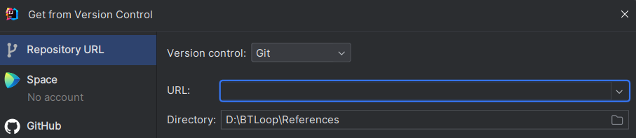

# ***English - Vietnamese Learner's Dictionary***

## I. Introduction

+ This is the first edition English - Vietnamese dictionary is planned and implemented for by a group of 3 students in University of Engineering and Technology for **Object - Oriented Programming Course**.
+ The Dictionary section includes about 100,000 English words with Vietnamese meanings and explanations, following by comprehensive, practical examples.
## II. Project Descriptions

### 1. Features
With our dictionary, you can use it with **multiple accounts independently** with various features:
+ **Search:** *Look up English words for corresponding Vietnamese meaning. Just search any word you like on the search bar and then enter or hit the search button to get the meaning and its examples.*
+ **Search Online:** *With each words, you can look up their definition online in Oxford dictionary by clicking See more button   *
+ **Word of the Day:**  *We provide for you one word a day. You can see it on a note pinned in **Home** section.*
+ **Recently Searched:** *Record your recently searched words.*
+ **Edit words:** *You can customize the word detail appearance as your wishes.*
+ **Save words:** *The dictionary provide a bookmark for you to save your favourite words when searching. You can review, add a note them later in **Saved Words** section.*
+ **Remove words:** *Redundant words? You can remove it from your dictionary.*
+ **Translate online:** *When having connected to the internet, you can translate words or sentences or even a paragraph online in the Translate Online section.*
+ **Add words:** *Having any fantastic words? Apart from those available words we provided for you, you can also add new words to the dictionary.* 
+ **Practise your vocabulary:** *Strengthen you vocabulary by quizzes and challenges such as Flashcards, MQCs, Matching.*
+ **Settings:** *Adjust voice type, change password or delete your accounts*

### 2. Installation
+ Install Java Development Kit 20.
+ Open IntelliJ > File > New > Project from Version Control... > Paste this link to URL field: https://github.com/tranminhtuan1709/Final_Dictionary

+ File > Project Structure... > Dependencies > (+) Button > JARs or Directories...

+ Go to the place you save the project > src > lib > voicerss_tts.jar > Ok > Apply > Ok

+ Find Main.java > click 
### 3. Preview

## III. Acknowledgement

#### **References**
+ The idea is inspired by *Oxford Advanced Learner's Dictionaries 9th Edition (DVD)*, *Cambridge Dictionary* and *Quizlet*.
+ All photographs are selected and modified by the team from many different sources online.
#### **Copyright**
+ No part of source code of this publication may be reproduced, stored in a retrieval system, or transmitted, in any form or by any means, without the prior permission in writing of our teams, or as expressly permitted by law, or under terms agreed with the appropriate reprographics rights organization.

## IV. Contact us

We hope that you'll enjoy using the English - Vietnamese Learner's Dictionary 1st edition.
#### Developers
1. [Phan Anh Tú](https://github.com/tuphan22028238)
   + GUI Design, implement FXML.
   + Handle Login, Home, Saved words, Add words, Information sections. 
   + Adjust display of dictionary.
   + Fix minor bugs.
   + Handle Database. (minority)
2. [Mai Anh Tuấn](https://github.com/anhtuan23004)
   + Handle Database. (majority)
   + Handle Speech.
   + Handle Home section, Game (1 game) sections.
   + Fix minor bugs.
   + Find resources: Database, Google Translate API.
3. [Trần Minh Tuấn](https://github.com/tranminhtuan1709)
   + Implement FXML.
   + Handle Menu, Home, Game (3 games), Settings sections.
   + Handle major transition effects.
   + Fix minor bugs.   
   + Handle Database.